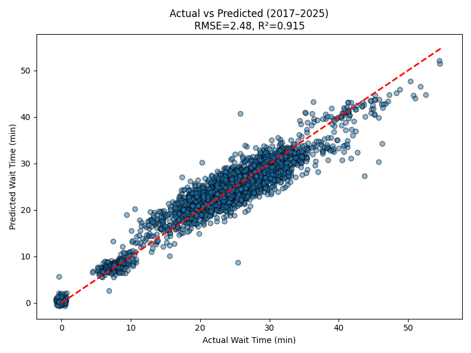

# Demand Prediction for Average Daily Wait Time at Universal Studios Singapore 
## Part 1: Demand Prediction for Daily Ride Wait Time at Universal Studios Singapore
### Overview
As part of Business Question 6, we aimed to build a demand prediction model using historical data and external factors such as weather data and events to forecast the **average daily wait time** for attractions at Universal Studios Singapore (USS).

Leveraging the analysis done under **`external_factors_analysis/README.md`**, we observed that factors like rain forecasts and rainfall significantly influence wait times. While **events** may not always have a direct effect, school holidays and public holidays show a stronger impact.

The ultimate goal is to extend this methodology beyond wait time predictions to include **daily attendance forecasts** and **individual ride wait time predictions**.

---

## Data
### Weather
Weather data was collected from reliable government sources:
- [[1] data.gov.sg](https://data.gov.sg/)
- [[2] Meteorological Service Singapore](https://www.weather.gov.sg/home/)

The data was filtered to include only readings from **Sentosa Island** (Station ID: S60), where USS is located. API calls were automated over a date range to extract JSON readings and convert them to tabular form using Python scripts in **`data/Meteorological/code_solutions`**. Processed data is stored in **`data/Meteorological/datasets/final_data`**.

Monthly weather data (2016–2025) was also manually downloaded from MSS and stored in **`data/Meteorological/datasets/raw_data/daily_data_sentosa/sentosa_data.zip`**, with cleaning done via **`merge_sentosa_data.py`**.

### Events
Events were included based on their **potential impact** on USS attendance. A threshold of **50,000 attendees** was used to flag events with a likely influence. Major examples include:
- **F1 Singapore Grand Prix**: 269,072 attendees (2024) [[3]](https://singaporegp.sg/en/news/2024/15th-edition-of-the-formula-1/)
- **Coldplay**: >200,000 attendees
- **Taylor Swift**: >300,000 attendees [[4]](https://www.straitstimes.com/singapore/consumer/top-tier-concerts-helped-draw-over-a-million-visitors-to-sports-hub-in-first-3-months-of-2024)

Events may decrease attendance (conflict of interest) or increase it (foreigners attending multiple attractions). Around **half of Taylor Swift’s attendees were tourists** [[5]](https://www.channelnewsasia.com/singapore/taylor-swift-coldplay-concerts-singapore-economy-mas-4292951).

Data was manually gathered from [[6] Wikipedia](https://en.wikipedia.org/wiki/Main_Page), [[7] Visit Singapore](https://www.visitsingapore.com/whats-happening/all-happenings/), and [[8] The Straits Times](https://www.straitstimes.com/singapore/strong-slate-of-mice-events-around-singapore-grand-prix-period-despite-expected-fall-in-race-attendance?utm_source=chatgpt.com).

### School & Public Holidays
Holiday data (2016–2025) was scraped from:
- [[9] MOE](https://www.moe.gov.sg/news/press-releases/20221019-school-terms-and-holidays-for-2023)
- [[10] data.gov.sg](https://data.gov.sg/datasets?query=public+holiday&page=1&resultId=691)

Scripts for merging and processing are located in **`data/Events/Holidays/code_solutions`**, with final data stored in **`data/Events/Holidays/datasets`**. Additional documentation is available in **`data/Events/Holidays/README_HOLIDAYS.md`**.

### Labelled & Synthetic Data
Labeled wait time data (2023–2024) was collected from [[11] Thrill Data](https://www.thrill-data.com/waits/park/unit/universal-studios-singapore/). To extend coverage to 2017–2023 November, **partially synthetic wait times** were generated using **Random Forest**, trained on real labeled data (from December 2023 to February 2025) and external factors. This approach ensures data continuity while simulating real-world patterns [[12] Caiola et al., 2010](https://citeseerx.ist.psu.edu/document?repid=rep1&type=pdf&doi=069e26205b9dbdc82c5ab31721b0a03f325294db).

Code for the following is available in the **`data/uss_wait_times`** directory.

---

## Methodology
### Data Preprocessing
1. **Data Aggregation:**
   - Daily average wait times computed.
   - Monthly tourism data aggregated and merged.
2. **Feature Engineering:**
   - Encoded categorical variables (e.g., holidays, weekdays).
   - Weather metrics included temperature, rainfall, wind speed, humidity.
   - **Time-based features**:
     - Lag features (e.g., previous day’s wait time)
     - Rolling averages and standard deviations (3, 5, 7-day)
     - Holiday-weekend interaction terms

### Modelling Approach
- Machine Learning Models evaluated:
  - Linear Regression, Ridge, Lasso
  - Support Vector Regression
  - Random Forest
  - XGBoost
  - Gradient Boosting

- Preprocessing scenarios:
  - **Base**, **Variance Threshold (VT)**, **PCA**, and **PCA & VT**

- **Hyperparameter tuning:**
  - Conducted using `RandomSearchCV` from **scikit-learn**

- **Final model:**
  - **Gradient Boosting Regressor (Base)** was selected due to:
    - Highest **R² = 0.900**, lowest **RMSE = 2.82**
    - Outperformed models with additional preprocessing (PCA or VT), suggesting raw features retained more useful signals

---

## Results
### Performance Summary
#### Base Machine Learning Models
| Model                      | Preprocessing | Test RMSE | Test R²  |
|----------------------------|---------------|-----------|----------|
| Linear Regression          | Base          | 2.82      | 0.900    |
| Ridge Regression           | Base          | 2.82      | 0.900    |
| Lasso Regression           | Base          | 2.89      | 0.895    |
| Support Vector Regression  | Base          | 3.30      | 0.863    |
| **Gradient Boosting**      | **Base**      | **2.48**  | **0.915**|
| Random Forest              | Base          | 3.04      | 0.884    |
| XGBoost                    | Base          | 2.83      | 0.899    |

#### Machine Learning Models With Preprocessing
| Model                    | Preprocessing     | Test RMSE | Test R²  |
|--------------------------|-------------------|-----------|----------|
| Ridge Regression         | PCA               | 3.78      | 0.821    |
| Lasso Regression         | PCA               | 3.81      | 0.817    |
| Support Vector Regression| PCA               | 3.94      | 0.805    |
| Gradient Boosting        | PCA               | 3.85      | 0.814    |
| Random Forest            | PCA               | 3.93      | 0.806    |
| XGBoost                  | PCA               | 3.87      | 0.812    |
| Linear Regression        | VarianceThreshold | 2.83      | 0.899    |
| Ridge Regression         | VarianceThreshold | 2.83      | 0.899    |
| Lasso Regression         | VarianceThreshold | 2.89      | 0.895    |
| Support Vector Regression| VarianceThreshold | 3.29      | 0.864    |
| Gradient Boosting        | VarianceThreshold | 2.83      | 0.899    |
| Random Forest            | VarianceThreshold | 3.05      | 0.883    |
| XGBoost                  | VarianceThreshold | 2.83      | 0.899    |
| Linear Regression        | VT + PCA          | 3.78      | 0.821    |
| Ridge Regression         | VT + PCA          | 3.78      | 0.821    |
| Lasso Regression         | VT + PCA          | 3.81      | 0.817    |
| Support Vector Regression| VT + PCA          | 3.94      | 0.805    |
| Gradient Boosting        | VT + PCA          | 3.89      | 0.810    |
| Random Forest            | VT + PCA          | 3.94      | 0.805    |
| XGBoost                  | VT + PCA          | 3.90      | 0.809    |

<table>
  <tr>
    <td align="center">
      
       
      <strong>Figure 1:</strong> Scatterplot of Actual vs Predicted values
    </td>
    <td align="center">
      
       
      <strong>Figure 2:</strong> Top 15 Feature Importance weightage
    </td>
  </tr>
</table>

---

## Conclusion & Future Work
- **Gradient Boosting** proved to be the most effective model out of all variations tested.
- PCA and Variance Threshold **did not enhance performance**; they may have removed predictive signals.
- Future work can include using real world data from 2017 to 2023, and utilise a a full real-world labelled dataset to retrain model and evaluate once more.

### Key Insights
- Final Gradient Boosting showed the strongest performance with the following metrics(**RMSE: 2.48**, **R²: 0.915**).
- **Lag features** (wait times from previous 1–3 days) were the most predictive as shown from feature importance chart.
- Weather and event data had **lower feature importance** as compared to time-series features, but still played a part in determining wait times nonetheless.
- Demand for attractions is highly **time-sensitive**, indicating a need for robust, accurate and frequent updates in forecasting systems to continuously predict wait times accurately.

### Business Impact
- Investing in accurate, high-frequency wait time prediction systems helps prevent **operational blind spots** and avoids **snowballing inaccuracies** from outdated data. This  ensures **continuity in predictive accuracy for rides**, ultimately enhancing overall guest experience with accurate information and operational efficiency at scale.
- Enhances **staffing and resource allocation** with accurate daily demand forecasts.
- Supports **ride-level and intraday wait time predictions** for real-time operations.
- Can be integrated with **workforce optimization tools**, creating a robust demand + resource allocation pipeline to dynamically reduce wait times and manage manpower requirements.
- As a result of good resource allocation and efficiency in wait times, guest experience can thus be enhanced and lead to guests having a positive experience at USS, encouraging revisiting or publishing of good online reviews.
- Framework can be extended to predict other metrics such as **attendance**, **F&B demand**, or **retail sales**.

### Next Steps
- Explore deep learning (LSTM, Transformers) for temporal dynamics. This will require even more data collection given the nature of deep learning.
- Extend to forecasting **attendance**, **individual ride wait times** and other demand-related targeted variables to build Prediction Models using a similar methodology.
- Developing the aforementioned Pipeline or Integrating demand prediction model into existing **staffing and operations tools**.

## Part 2: Extension of existing methodology to Daily Attendance Prediction and Individual Rides Wait Time prediciton
### Overview:
Building on the knowledge, methodology and results gained from Part 1, we would like to extend demand prediction for **Daily Attendance Counts** and **Individual Ride Wait Times Prediciton**

Leveraging the analysis and features used in **PART 1**, we could use similar approaches to build prediction models for the two aforementioned variables. Demand Prediction in Daily Attendance Counts is beneficial to USS as it allows management to get rough estimates into the total head count for the days to come. This allows for efficient planning and allocation of different resources such as manpower needs, merchandise and invetory allocation and so forth.

Additionally, on top of daily wait time for rides which helps in providing customers with a general sensing on wait times across the park, it is valuable to extend to individual rides as through providing guests with accurate wait times per ride, they are able better to plan their routes within USS. Live Forecasting of times would give guests valuable information as to which rides are viable and worth queuing up for, given that each guests has different preference for rides, different USS trip itineraries and so forth. This would help to enhance guests experience as they would have more information readily available which they can use to plan a memorable day in USS.

## Data
### Weather
Similar to part 1, weather data was collected from reliable government sources:
- [[1] data.gov.sg](https://data.gov.sg/)

- For demand prediction for **Daily Attendance Counts**. Weather Data used was the same as that used in Part 1.
- For demand prediction for **Individual Ride Wait Times**, weather data was collected from [[1] data.gov.sg](https://data.gov.sg/), however, the data used were weather forecast data that came in intervals, this is due to the labelled, target data being in intervals of 5 as well.

### Events
Events data used as per mentioned earlier

### School & Public Holidays
School Holidays and Public Holidays data used as per mentioned earlier.

### Labelled & Synthetic Data
Labelled data for daily attendance counts was synthetically generated, using the Daily Wait Time data previously mentioned in Part 1 and Yearly USS Attendance that was available from years 2017 to 2022 [[13]](https://en.wikipedia.org/wiki/Universal_Studios_Singapore) as basis to generate synthetic data. Similar to the generation of partially synthetic wait time data, **Fully Synthetic Daily Attendance** data was generated using **Random Forest**, trained on then wait time data (from 2017 to February 2025) and external factors 
like weather, events and holidays.

More details regarding synthetic data generation and final dataset can be found in **`data/singapore_tourism_data`** folder.

Labelled data for Predicted Wait Time for each ride in USS can be found in **`data/uss_ride_wait_times`** folder, For each ride, Ride Wait Time was provided every 5 Minutes. The folder includes the used to scrape the aforementioned data. Data was collected from [[11] Thrill Data](https://www.thrill-data.com/waits/park/unit/universal-studios-singapore/).

# Methodology
### Data Preprocessing
1. **Data Aggregation:**
   - Similar to previous methodology.
2. **Feature Engineering:**
   - Encoded categorical variables (e.g., holidays, weekdays).
   - Weather metrics included temperature, rainfall, wind speed, humidity. (for Daily Attendance prediction)
   - Weather metrics included rainfall, two-hourly weather forecast data.
   - For each 5-minute ride wait time interval. Processing was done to tag each individual 5 Minute Interval to the correct two-hour interval it belongs to.
   - **Time-based features**:
   Similar to previous methodology, Time-Based features were also introduced to enhance model performance and represent Time-based properties in the data.
     - Lag features (e.g., previous day’s wait time)
     - Rolling averages and standard deviations (3, 5, 7-day)
     - Holiday-weekend interaction terms

### Modelling Approach (Daily Attendance)
- Machine Learning Models evaluated for :
  - Linear Regression, Ridge, Lasso
  - Support Vector Regression
  - Random Forest
  - XGBoost
  - Gradient Boosting

- Preprocessing scenarios:
  - **Base**, **Variance Threshold (VT)**, **PCA**, and **PCA & VT**

- **Hyperparameter tuning:**
  - Conducted using `RandomSearchCV` from **scikit-learn**

- **Final model:**
  - **Gradient Boosting Regressor (Base)** was selected due to:
    - Highest **R² = 0.900** and lowest **RMSE = 2.82**
    - Outperformed models with additional preprocessing (PCA or VT), suggesting raw features retained more useful signals

## Results
### Model Performance Summary for USS Daily Attendance Prediction

| Model                      | Preprocessing        | Test RMSE | Test R² |
|----------------------------|----------------------|-----------|---------|
| **Linear Regression**      | **Base**             | **547.08**|**0.981**|
| Ridge Regression           | Base                 | 566.54    | 0.979   | 
| Lasso Regression           | Base                 | 559.73    | 0.980   |
| Support Vector Regression  | Base                 | 3236.64   | 0.329   |
| Gradient Boosting          | Base                 | 589.11    | 0.978   |
| Random Forest              | Base                 | 636.00    | 0.974   |
| XGBoost                    | Base                 | 609.89    | 0.976   |

| Model                      | Preprocessing        | Test RMSE | Test R² |
|----------------------------|----------------------|-----------|---------|
| Linear Regression          | VarianceThreshold    | 552.16    | 0.980   |
| Ridge Regression           | VarianceThreshold    | 568.80    | 0.979   |
| Lasso Regression           | VarianceThreshold    | 559.96    | 0.980   |
| Support Vector Regression  | VarianceThreshold    | 3234.69   | 0.330   |
| Gradient Boosting          | VarianceThreshold    | 599.79    | 0.977   |
| Random Forest              | VarianceThreshold    | 635.89    | 0.974   |
| XGBoost                    | VarianceThreshold    | 609.89    | 0.976   |

| Model                      | Preprocessing        | Test RMSE | Test R² |
|----------------------------|----------------------|-----------|---------|
| Linear Regression          | PCA                  | 670.36    | 0.971   |
| Ridge Regression           | PCA                  | 670.08    | 0.971   |
| Lasso Regression           | PCA                  | 670.18    | 0.971   |
| Support Vector Regression  | PCA                  | 3144.99   | 0.367   |
| Gradient Boosting          | PCA                  | 730.52    | 0.966   |
| Random Forest              | PCA                  | 904.42    | 0.948   |
| XGBoost                    | PCA                  | 734.31    | 0.965   |

| Model                      | Preprocessing        | Test RMSE | Test R² |
|----------------------------|----------------------|-----------|---------|
| Linear Regression          | VT + PCA             | 670.39    | 0.971   |
| Ridge Regression           | VT + PCA             | 670.11    | 0.971   |
| Lasso Regression           | VT + PCA             | 670.20    | 0.971   |
| Support Vector Regression  | VT + PCA             | 3144.92   | 0.367   |
| Gradient Boosting          | VT + PCA             | 729.67    | 0.966   |
| Random Forest              | VT + PCA             | 907.88    | 0.947   |
| XGBoost                    | VT + PCA             | 740.00    | 0.965   |

## Attendance Demand Prediction Figures
<table>
  <tr>
    <td align="center">
      
       
      <strong>Figure 3:</strong> Scatterplot of Actual vs Predicted values using Gradient Boosting
    </td>
    <td align="center">
      
       
      <strong>Figure 4:</strong> Top 10 Feature Importance weightage regarding Attendance Counts Prediction
    </td>
  </tr>
</table>

---

# Conclusion & Future Work
- Linear Regression performed best when building Demand Prediction Model with synthetic Attendance Count Data
- Future work can include actual Attendance Counts Data in training of model, a limitation of this current endeavour as Attendance Data is not readily available.
- Further features could be included in training model, such parameters could include Guest Segmentation data and so forth.
- Synthetic data was generated using wait time as a basis, which may not be an acurrate assumption as there could be days where attendance is higher but such an increase may not necessarily translate to higher wait times, and vice versa.

### Key Insights
- ML Models seemed to perform relatively similar to each other, with Support Vector Regression being an outlier
- ML Modelling for Daily Attendance Counts following a similar methodology to the previously discussed Ride Wait Time prediction and synthetic labelled data did show promising results
- Most important features again are temporal, time-based features such as 3-Day Rolling Mean and Attendance Count of the day before. Highlighting the time-based nature of demand prediction for attendance.

### Business Impact
- Worthy to invest into building even more robust predictive modelling into Attendance Counts
- Could expand Attendance Counts prediction to those who buy tickets online or in person. Online tickets demand prediction can drive data-driven marketing strategies to attract even more customers
- In person ticket purchasing when predicted can help USS to plan customer service and ticketing counter manpower.

### Next Steps
- Explore deep learning (LSTM, Transformers) for temporal dynamics. This will require even more data collection given the nature of deep learning.
- Develop or fortify existing Attendance Counts Prediction Models with real world data that better represent real conditions.

## Part 3: Extension of existing methodology to Individual Rides Wait Time prediciton
### Overview:
With Part 2 covering the data composition, data sources and datasets, feature engineering and methodology with training, we have built a function that thinks in an input to build a Machine Learning Model to predict 5 Minute Interval Wait times. The input takes in a lowercase, simplified name of the rides, in which names can be referenced from CSV File naming conventions in **`data/uss_ride_wait+times`**. Upon successful running of the code with a Ride, a **new subfolder** with the Ride's name will appear in **`demand_prediction/USS_rides_wait_time_prediction/models`** with the evaluation metrics and the stored model.

The code to generate the model and evaluation graphs can be found in **`demand_prediction/USS_rides_wait_time_prediction/python_scripts`**.

### Results:
Generally across the board, the model performed well and had strong performance in wait-time prediction. Showing promise that adopting a similar methodology as the previously discussed parts can be adopted and incorporated into Individual Ride Wait Time prediction.

### Attendance Demand Prediction Figures

  
   
  <strong>Figure 5:</strong> Scatterplot of Actual vs Predicted Wait Time values using Gradient Boosting for Minion Mayhem

  
   
  <strong>Figure 6:</strong> Top 15 Feature Importance weightage in Gradient Boosting Model

## Conclusion
 Methodology from Daily Wait Time Prediction can be applied to individual rides. However, further steps could include using more days worth of data, as model was trained on a few months worth of data that are available publicly on **Thril Data**. More can be done utilising data from internal USS Databases as more leverage to train more robust and accurate models. Accurate Ride Wait times for individual rides are crucial to the guests experience as they allow guests to estimate and plan their route around USS with confidence and ease.

## References
<a id="1">[1]</a> data.gov.sg. (n.d.). Retrieved 24 February 2025, from https://data.gov.sg/

<a id="2">[2]</a> Meteorological Service Singapore. (n.d.). Retrieved 24 February 2025, from https://www.weather.gov.sg/home/

<a id="3">[3]</a> Singapore Grand Prix. (2024). 15th Edition of the Formula 1 Singapore Grand Prix. Retrieved from https://singaporegp.sg/en/news/2024/15th-edition-of-the-formula-1/

<a id="4">[4]</a> The Straits Times. (2024). Top-tier concerts helped draw over a million visitors to Sports Hub in first 3 months of 2024. Retrieved from https://www.straitstimes.com/singapore/consumer/top-tier-concerts-helped-draw-over-a-million-visitors-to-sports-hub-in-first-3-months-of-2024

<a id="5">[5]</a> Channel News Asia. (2024). Taylor Swift, Coldplay concerts in Singapore boosted economy. Retrieved from https://www.channelnewsasia.com/singapore/taylor-swift-coldplay-concerts-singapore-economy-mas-4292951

<a id="6">[6]</a> Wikipedia. (n.d.). Retrieved from https://en.wikipedia.org/wiki/Main_Page

<a id="7">[7]</a> Visit Singapore. (n.d.). Retrieved 27 February 2025, from https://www.visitsingapore.com/whats-happening/all-happenings/

<a id="8">[8]</a> The Straits Times. (2024). Strong slate of MICE events around Singapore Grand Prix period. Retrieved from https://www.straitstimes.com/singapore/strong-slate-of-mice-events-around-singapore-grand-prix-period-despite-expected-fall-in-race-attendance?utm_source=chatgpt.com

<a id="9">[9]</a> Ministry of Education Singapore. (2022). School Terms and Holidays for 2023. Retrieved from https://www.moe.gov.sg/news/press-releases/20221019-school-terms-and-holidays-for-2023

<a id="10">[10]</a> data.gov.sg. (n.d.). Public Holidays Dataset. Retrieved 24 February 2025, from https://data.gov.sg/datasets?query=public+holiday&page=1&resultId=691

<a id="11">[11]</a> Thrill Data. (n.d.). Universal Studios Singapore Wait Times. Retrieved 24 February 2025, from https://www.thrill-data.com/waits/park/unit/universal-studios-singapore/

<a id="12">[12]</a> Caiola, G., & Reiter, J. P. (2010). Random forests for generating partially synthetic, categorical data. *Trans. Data Priv.*, 3(1), 27–42. Retrieved from https://citeseerx.ist.psu.edu/document?repid=rep1&type=pdf&doi=069e26205b9dbdc82c5ab31721b0a03f325294db

<a id="13">[13]</a> Wikipedia. (n.d.). Retrieved 20 March 2025, from https://en.wikipedia.org/wiki/Universal_Studios_Singapore