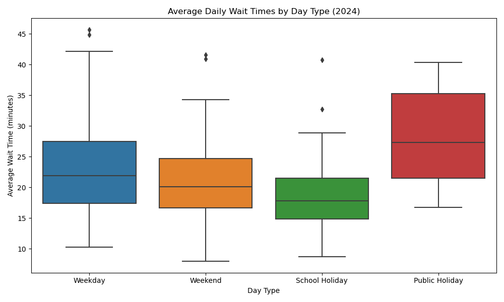
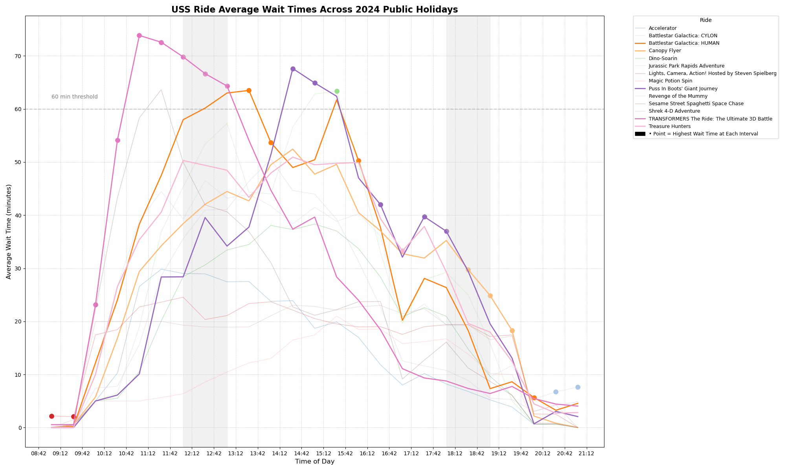
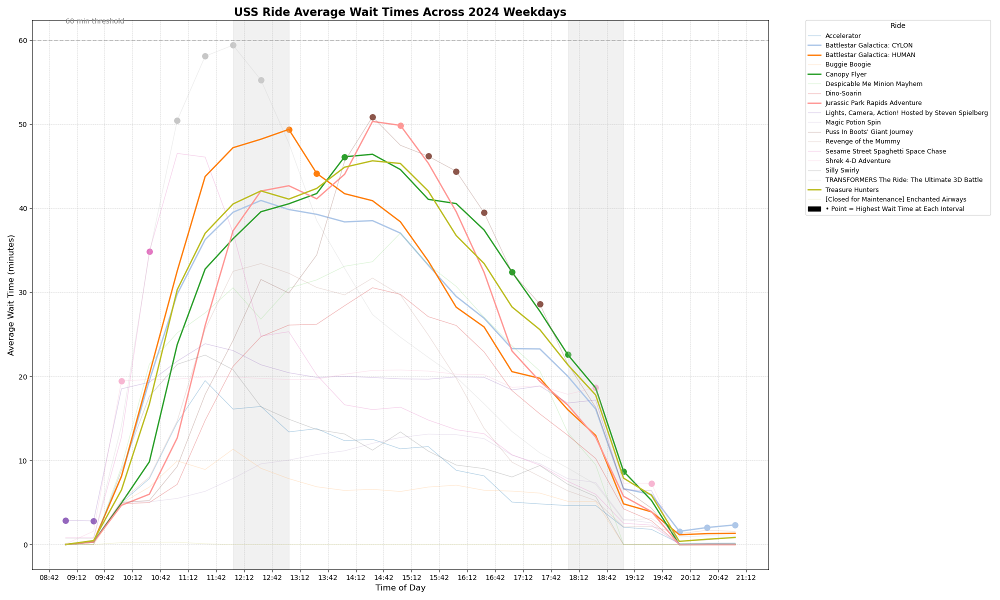
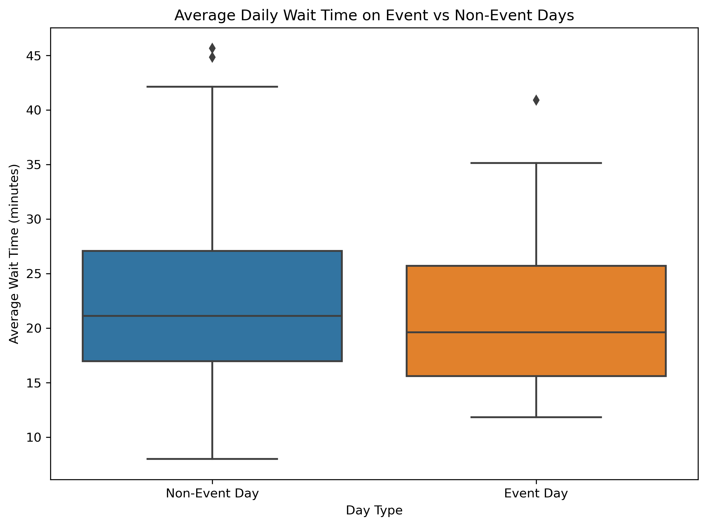
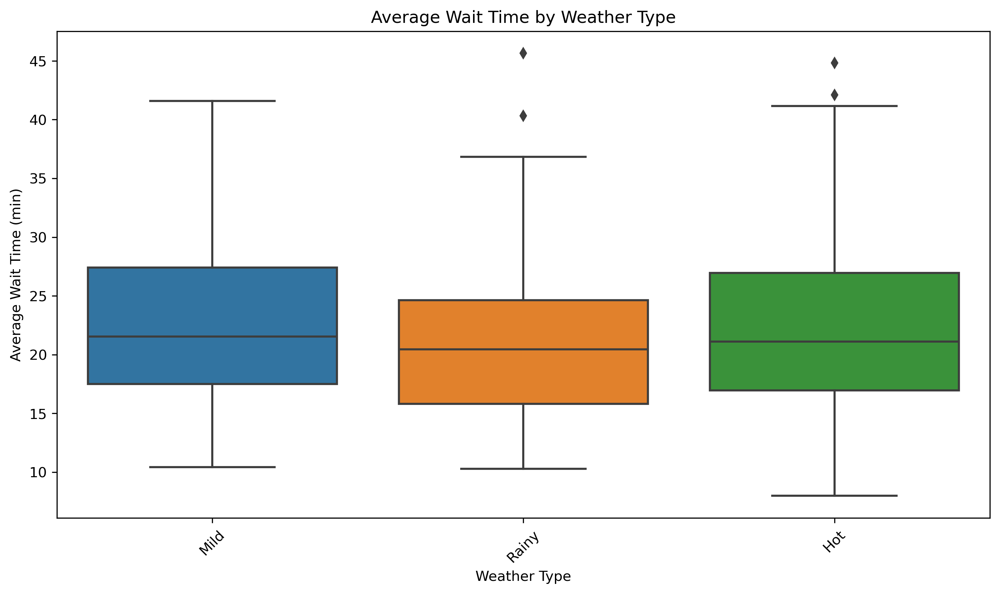
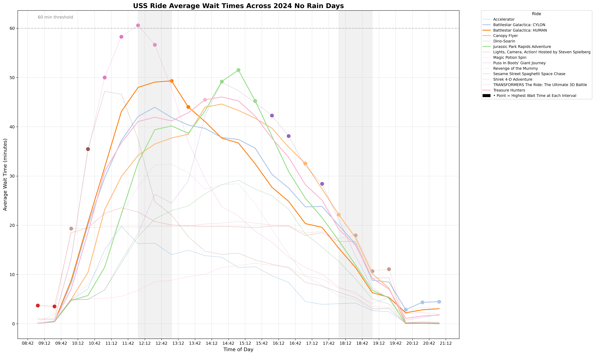
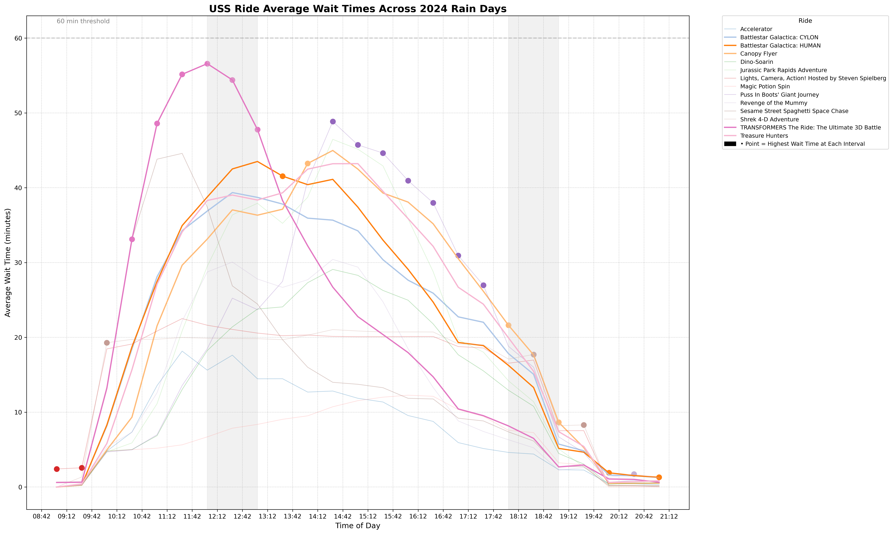
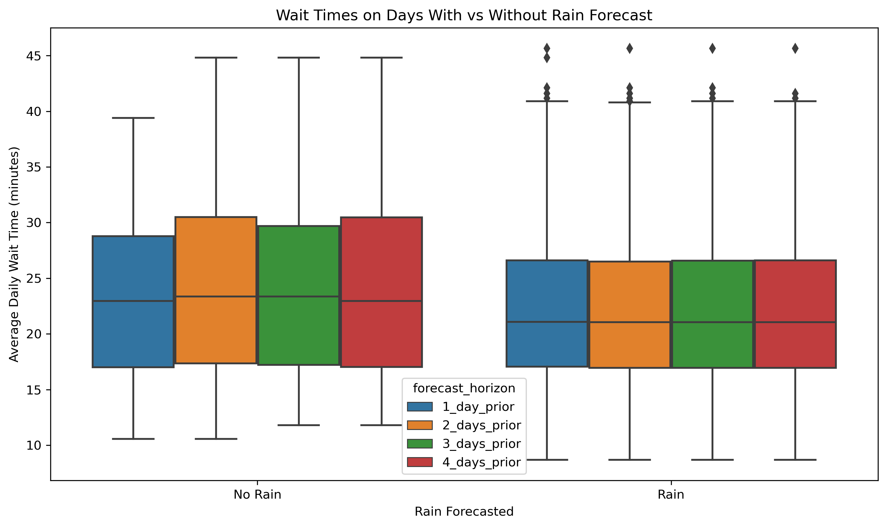

# Overview
The main objective of this analysis on external factors is to see how external factors impact visitors' attendance to Universal Studios Singapore (USS). More importantly, this analysis aims to provide insight business recommendations regarding external factors.

# Retrieving Data

The data we utilised are sourced from public sources, as time series data over the span of a year was required for an ideal analysis. In addition, our survey data had a bias towards residents, and had very little data on tourists.

To retrieve all the necessary data from the `.csv` files in the data folder, follow the steps below:
1. Navigate to `DSA3101-Group5/` by running `cd DSA3101-Group5`. 
2. Run the file `data.py`.

This ensures that all the data will be saved as the necessary variables that will be used in the subsequent analysis Python files.

The data includes:
- Tourism data (by region and age group)
    - Tourism data by region: `tourism`
    - Tourism data by age_group: `tourism_age`
- Wait time (overall and by rides)
    - Overall wait time: `wait_time`
    - Wait time by rides: `ride_wait_times`
- Holidays and events
    - Event data: `events`
    - School holiday data: `school_holidays`
    - Public holiday data: `public_holidays`
- Weather data (forecast and actual)
     - Weather forecast data: `four_day_forecast`
     - Weather data: `weather`
- Ride data: `rides`

# Analysis
To see the visualisations, run the individual Python files. Alternatively, the visualisations are also saved in their respective folders. The Python files and folders are listed below.
1. International Tourists
    - Python file: `international_tourist_trends.py`
    - Folder: international_tourist_figures
2. Local Holidays 
    - Python file: `local_holidays.py`
    - Folder: local_holiday_figures
3. Events
    - Python file: `events.py`
    - Folder: event_figures
4. Weather
    - Python file: `weather.py`
    - Folder: weather_figures
5. Weather Forecast
    -  Python file: `weather_forecast.py`
    - Folder: weather_forecast_figures

Plots are generated using seaborn and matplotlib. Data processing and manipulation is done using pandas.

## International Tourists
To begin, we analyse the patterns between wait times in USS in 2024 against overall tourist numbers in Singapore.

  
   

We can see that there are general increases during February, August, October and a slight increase in December. The largest increases are in February and August. There is also a dip in November and subsequent increase in December. This trend applies for both average wait times in Universal Studios Singapore, and also for the number of tourists coming into Singapore in the year 2024. Hence, from this we can observe and understand that the general trends of the Universal Studios wait times is similar to the tourist numbers in 2024, since a proportion of the Universal Studios visitors would also be international tourists in Singapore. Thus, when there is an influx of tourists, there will likely also be an increase in visitors to Universal Studios, as Universal Studios is considered as a tourist attraction in Singapore. According to TripAdvisor, Universal Studios is the #1 out of 29 things to do in Singapore [[1]](#1).

In addition, we can see that there is an influx of tourists in the year 2024 from January to February, as well as June to August. The influx of tourists in June to August correlates with the summer holidays overseas. In February, this could be due to the influx of Chinese tourists during the Chinese New Year holidays, which also coincides with their school winter break.

As expected, we can see that the influx of tourists in February is likely due to the increase in tourists from China, where there is a significant spike in the number of tourists from Greater China in February. In addition, we can also see a spike in the number of tourists from Europe in the months of June to August, though not as significant as the spike in the number of tourists from Greater China. Once again, this sharp increased can be explained by the Chinese school summer holidays, which fall on January and August.

According to the Singapore Tourism Board (STB), "Mainland China, Indonesia, and Australia emerged as the top tourism receipts generating markets, contributing $3.58 billion, $2.13 billion, and $1.44 billion respectively". In addition, "Top markets for visitor arrivals were Mainland China (3.08 million), Indonesia (2.49 million) and India (1.20 million)" [[2]](#2). Because Chinese tourists account for not only the largest spenders but also the largest proportion of international visitors to enter Singapore, we can zoom our analysis into the months in which there is a significant spike in the number of international tourists from Greater China and analyse their behaviour. Thus, we will look into the average wait times for individual rides throughout the day for February and July.

  
   

These line charts show the wait times every 30 minutes for every ride in USS. The dots indicate the highest wait time at every interval. The bolded lines show the wait time line graphs for the top 5 rides. The greyed out areas show lunch (12pm - 1pm) and dinner times (6pm - 7pm) respectively.

To produce this visualisation, we first have to change the intervals into 30 mins, instead of the original 5 minutes in the dataset. Next, we shorten the timings to within the opening hours of the park. Then, we get the maximum wait times of every interval and plot them as scatterplots, such that when the plots are overlaid, it will be presented as points on the graph. A 60-min threshold line is also added for easy comparison of the graphs.

Top rides in February: 
| Ride                                               | Type                           | Environment |
|----------------------------------------------------|--------------------------------|-------------|
| Canopy Flyer                                       | Aerial Ride                    | Outdoor     |
| Jurassic Park Rapids Adventure                     | River Raft Ride                | Outdoor     |
| Puss In Boots' Giant Journey                       | Family Roller Coaster          | Outdoor     |
| TRANSFORMERS The Ride: The Ultimate 3D Battle      | Hyper-realistic 3D Thrill Ride | Indoor      |
| Treasure Hunters                                   | Motor Car Ride                 | Outdoor     |

Top Rides in July:
| Ride                                              | Type                                 | Environment |
|---------------------------------------------------|--------------------------------------|-------------|
| Battlestar Galactica: CYLON                      | High Speed Turbulent Roller Coaster | Outdoor     |
| Battlestar Galactica: HUMAN                      | High Speed Turbulent Roller Coaster | Outdoor     |
| Jurassic Park Rapids Adventure                   | River Raft Ride                     | Outdoor     |
| TRANSFORMERS The Ride: The Ultimate 3D Battle    | Hyper-realistic 3D Thrill Ride      | Indoor      |
| Treasure Hunters                                  | Motor Car Ride                      | Outdoor     |

From this, we can see the lower intensity rides tend to be more popular, such as the Transformers ride, and Puss in Boots' Giant Journey in February. However, in the month of July, high intensity rides such as Battlestar Galactica tend to be more popular.

This trend can further be explained by the bar chart above by the age groups of tourists visiting Singapore. In February, a higher proportion of tourists tend to be older, and thus would take lower intensity rides. However, in July, a higher proportion of tourists tend to be younger, and thus would want to take higher intensity rides. 

With this newfound information, we can now conclude that during the peak tourist months of February and July, we can adjust our operations such that more resources are allocated to the rides with highest popularity.

## Local Holiday
Firstly, we can examine the differences in average wait times between weekdays, weekends, public holidays, and school holidays.

The boxplot shows the following:

| Day Type        | Mean      | Std Dev   | Min       | 25%       | 50%       | 75%       | Max       |
|------------------|-----------|-----------|-----------|-----------|-----------|-----------|-----------|
| Public Holiday   | 28.102448 | 7.956224  | 16.755906 | 21.500568 | 27.326261 | 35.293277 | 40.316667 |
| School Holiday   | 18.800430 | 5.778887  | 8.692308  | 14.847004 | 17.779974 | 21.526208 | 40.778846 |
| Weekday          | 23.221790 | 7.665833  | 10.294118 | 17.390873 | 21.933553 | 27.484807 | 45.646154 |
| Weekend          | 21.486968 | 6.924492  | 7.990741  | 16.659163 | 20.131098 | 24.693750 | 41.586957 |

From this, we can see that school holidays, in fact, do not have as great of an effect on the attendance rates as compared to public holidays. This could be explained by the fact that it is easier for Singapore residents to go for a short trip to Universal Studios Singapore when they only have one day of break during the Public Holidays. During the school holidays when they have a longer break, it is more likely for families to travel overseas.

Thus, we can focus on the days with public holidays to see how the behaviour of visitors is compared to a typical weekday, such that we can make operational adjusments.

  
   

Top Rides during Public Holidays:
| Ride                                              | Type                                 | Environment |
|---------------------------------------------------|--------------------------------------|-------------|
| Battlestar Galactica: HUMAN                      | High Speed Turbulent Roller Coaster | Outdoor     |
| Canopy Flyer                                      | Aerial Ride                          | Outdoor     |
| Puss In Boots' Giant Journey                      | Family Roller Coaster                | Outdoor     |
| TRANSFORMERS The Ride: The Ultimate 3D Battle    | Hyper-realistic 3D Thrill Ride      | Indoor      |
| Treasure Hunters                                  | Motor Car Ride                       | Outdoor     |

Top Rides during Weekdays:
| Ride                                | Type                                 | Environment |
|-------------------------------------|--------------------------------------|-------------|
| Battlestar Galactica: CYLON        | High Speed Turbulent Roller Coaster | Outdoor     |
| Battlestar Galactica: HUMAN        | High Speed Turbulent Roller Coaster | Outdoor     |
| Canopy Flyer                        | Aerial Ride                          | Outdoor     |
| Jurassic Park Rapids Adventure     | River Raft Ride                      | Outdoor     |
| Treasure Hunters                    | Motor Car Ride                       | Outdoor     |

From the 2 graphs, we can thus observe that the rides that are more popular will be different. For instance, there are more low-intensity rides that are popular during public holidays. From the segmentation data, we can tell that ride-intensity correlates to what people tend to spend on during their trip. Because of this, we can make operational adjustments. For instance, since lower-intensity rides tend to correlate to increased spending in areas such as transportation and merchandise, we can shift our focus to more merchandise advertising/sales during public holiday periods. 

## Events

The boxplot shows the following:

| Event_Label   | Mean      | Std Dev   | Min       | 25%       | 50%       | 75%       | Max       |
|---------------|-----------|-----------|-----------|-----------|-----------|-----------|-----------|
| Event Day     | 21.032128 | 6.445091  | 11.814815 | 15.585160 | 19.597129 | 25.709500 | 40.900000 |
| Non-Event Day | 22.392944 | 7.619627  | 7.990741  | 16.971289 | 21.118555 | 27.059355 | 45.646154 |

From this, we can see that having a significant event and not having a significant event happening in Singapore does not affect the general waiting times in the park. While there is an increase in tourism when there are significant events such as the Formula 1 Grand Prix or concerts, there is not a significant increase in attendance to Universal Studios. School holidays seem to have a more significant impact and thus, would be more reasonable for us to analyze visitor segment size and behaviour during those periods, which we have done.

## Weather

| Weather Category | Mean      | Std Dev   | Min       | 25%       | 50%       | 75%       | Max       |
|------------------|-----------|-----------|-----------|-----------|-----------|-----------|-----------|
| Hot              | 22.400991 | 7.672365  | 7.990741  | 16.964286 | 21.096429 | 26.965643 | 44.814815 |
| Mild             | 22.756109 | 7.173616  | 10.435185 | 17.489258 | 21.545455 | 27.407407 | 41.586957 |
| Rainy            | 21.130045 | 7.148358  | 10.287037 | 15.815217 | 20.443396 | 24.625000 | 45.646154 |

Thus, we can see that rainy weather does in fact cause wait times to fall, compared to when there is no rain. Thus, we can begin our analysis on people's behaviour in the park when there is rain, compared to when there is no rain.

  
   

Top Rides during Rain:

| Ride                                              | Type                                 | Environment |
|---------------------------------------------------|--------------------------------------|-------------|
| Battlestar Galactica: CYLON                      | High Speed Turbulent Roller Coaster | Outdoor     |
| Battlestar Galactica: HUMAN                      | High Speed Turbulent Roller Coaster | Outdoor     |
| Canopy Flyer                                      | Aerial Ride                          | Outdoor     |
| TRANSFORMERS The Ride: The Ultimate 3D Battle    | Hyper-realistic 3D Thrill Ride      | Indoor      |
| Treasure Hunters                                  | Motor Car Ride                       | Outdoor     |

Top Rides When There is No Rain:

| Ride                              | Type                                 | Environment |
|-----------------------------------|--------------------------------------|-------------|
| Battlestar Galactica: CYLON      | High Speed Turbulent Roller Coaster | Outdoor     |
| Battlestar Galactica: HUMAN      | High Speed Turbulent Roller Coaster | Outdoor     |
| Canopy Flyer                      | Aerial Ride                          | Outdoor     |
| Jurassic Park Rapids Adventure   | River Raft Ride                      | Outdoor     |
| Treasure Hunters                  | Motor Car Ride                       | Outdoor     |

An interesting thing to note is that when comparing the times at which the wait times start to fall. For rainy days, the wait times start to fall around 2.30pm, while wait times start to fall around 3.30pm for non-rainy days. This could be an indication that visitors tend to leave earlier when there is rain. In addition, wait times in general tend to be lower for rainy days, with all the wait times below the 60 min threshold. The wiat times for non-rainy days are slightly higher. Non-rainy days have a slightly different selection of top 5 rides, which include more higher intensity rides at higher rankings. This could indicate higher spendings on F&B on non-rainy days, and higher spendings on merchandise and transportation on rainy days. Thus, this could indicate that operational adjustments need to be made when it is raining. For instance, more manpower can be allocated to merchandise booths and also for lower intensity rides, particularly sheltered rides.

In addition, for no rain days the most popular rides are all outdoors, while for rainy days, there is 1 ride that is the most popular that is indoors.

## Weather Forecast

| Rain Forecast | Mean      | Std Dev   | Min       | 25%       | 50%       | 75%       | Max       |
|----------------|-----------|-----------|-----------|-----------|-----------|-----------|-----------|
| False          | 23.971680 | 8.357916  | 10.571429 | 17.046296 | 22.960784 | 30.479167 | 44.814815 |
| True           | 22.088589 | 7.180962  | 8.692308  | 16.960784 | 21.054545 | 26.612245 | 45.646154 |

We conduct Ordinary Least Squares (OLS) Regression to derive further insights on the data.

OLS Regression was chosen because its aim is to estimate the relationship between a continuous variable (wait time) and a categorical variable (rain forecast). In addition, it gives us insights which is vital, such as "how many minutes less would the wait time be when there is rain forecasted?".

In comparison, models such as linear regression only works for binary outcomes, and t-test only compares mean, and is not ideal for controlling other variables.

The formula for OLS Regression is as shown:
$$
y = \beta_0 + \beta_1 x_1 + \beta_2 x_2 + ... + \epsilon
$$

- y: dependent variable
- $x_1$, $x_2$: independent variables
- $\beta_0$: intercept
- $\beta_1$, $\beta_2$: coefficients
- $\epsilon$: error term

The results are as shown below.

Model summary:

| Metric               | Value    |
|----------------------|----------|
| R-squared            | 0.007    |
| Adjusted R-squared   | 0.004    |
| F-statistic p-value  | 0.071    |
| No. of Observations  | 1155     |

Regression results:

| Variable                                 | Coefficient | Std. Error | t-Statistic | P-value | 95% CI Lower | 95% CI Upper | Interpretation                                                 |
|------------------------------------------|-------------|------------|-------------|---------|---------------|---------------|----------------------------------------------------------------|
| Intercept                                | 23.9821     | 0.703      | 34.112      | 0.000   | 22.603        | 25.361        | Average wait time when no rain is forecasted                   |
| Rain Forecast = True                     | -1.8828     | 0.640      | -2.941      | 0.003   | -3.139        | -0.627        | **Significant** decrease in wait time by ~1.88 mins on rainy days |
| Forecast Horizon = 2 Days Prior          | 0.0048      | 0.613      | 0.008       | 0.994   | -1.198        | 1.207         | Not significant                                                 |
| Forecast Horizon = 3 Days Prior          | -0.0119     | 0.612      | -0.019      | 0.984   | -1.214        | 1.190         | Not significant                                                 |
| Forecast Horizon = 4 Days Prior          | -0.0353     | 0.612      | -0.058      | 0.954   | -1.236        | 1.165         | Not significant                                                 |

Overall, from the model summary, we see that rain forecast explains 0.7% of the variability in wait times. Despite the low R² value, the rain forecast variable is still statistically significant. 

From this, we can see that having rain forecasted does indeed change the wait times compared to when there is no forecasted rain. In particular, when we analyse the Linear Regression p-value, we see that when rain is forecasted, it shows that it is statistically significant (p = 0.003 < 0.05). As such, we can see that rain forecast has an impact on the wait times and thus attendance. Diving deeper into the regression results, we can see that when rain is forecasted there is a 1.88 minute drop in wait times on average. 

With this new found information, we can then understand that there will be lower attendance, and utilise less staff when rain is being forecasted. 

# Conclusion

The most significant factor for USS to consider when making operational adjustments would be when the periods of peak international tourists are. With an influx of tourists, there will also be an influx of visitors to USS, which would have to be handled smoothly for the guests to have a pleasant experience. Some suggestions would be spreading out the crowds, which can be further derived from Question A3's guest journey patterns. In addition, resource allocation can be optimized by placing more staff at merchandise booths, and rides that tend to be more popular during peak periods. This can be further analysed in the Question B3 about resource allocation.

The least significant factor would be events. Thus, when considering operational adjustments, whether or not an event occurs should not be as much of a priority for businesses as compared to the other factors analysed above.

# References
<a id="1">[1]</a>  Tripadvisor (2024). https://www.tripadvisor.com.sg/Attraction_Review-g294264-d2439664-Reviews-Universal_Studios_Singapore-Sentosa_Island.html

<a id="2">[2]</a>  Singapore Tourism Board (4 February 2025). https://www.stb.gov.sg/about-stb/media-publications/media-centre/singapore-achieves-historical-high-in-tourism-receipts-in-2024