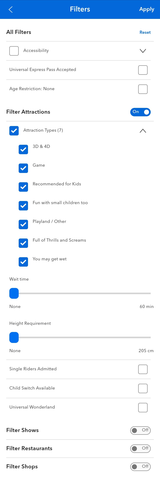
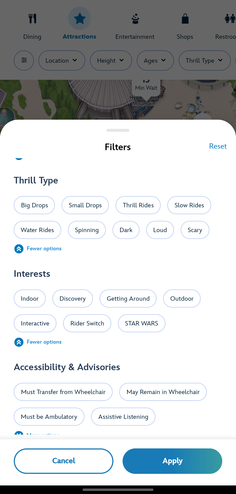
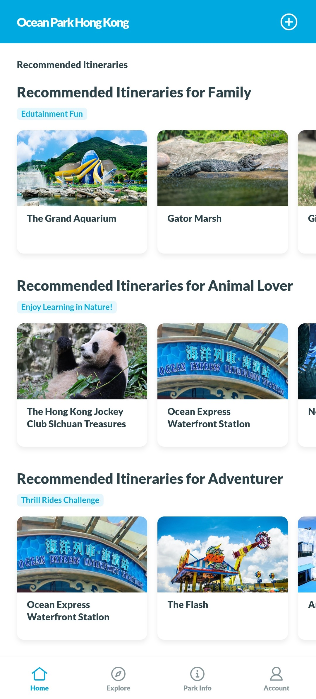

# Guest Journey Patterns
## Overview
This section aims to identify common guest journey paths amongst guests who visit USS. By comparing the similarities and differences of the journey paths across different segments of guests, it is possible to hence uncover opportunities for experience personalisations and any possible operational improvements.

## Data and Methodology
### Data in this Folder
This folder includes the following data:  
**Folder:** `images`
* Folder containing images used for this README

**Folder:** `spmf`
* Folder containing the spmf library and application used for sequence mining

**File:** `data_preparation.py` 
* Python script used to filter relevant responses from survey data
* Create list of sequences based on path matrix from survey data and concatenated to original survey data   

**File** `guest_journey_analysis.ipynb`
* Jupyter notebook for data visualisation and analysis   

**File:** `guest_path_plot.py`
* Python script used to generate plots on guests movement in the order of navigation of USS     

**File:** `sequence_mining.py`
* Python script for sequence mining using SPMF's TNS algorithm for sequence analysis

### Sequence Analysis using TNS Algorithm
The algorithm used for this project is the [TNS algorithm](https://www.philippe-fournier-viger.com/spmf/TopKNonRedundantSequentialRules.php), used for discovering the **top-k non-redundant sequential rules** appearing in a sequence database. 

The algorithm requires the following parameters:
* a sequence database for mining   
* integer `k` representing the number of sequence patterns to return
* float `minconf` in [0,1] as the minimum level of confidence
* `delta` >= 0 to increase chances of exact result

The algorithm has been incorporated into a larger function `sequence_mining.py` to process the data used for analysis in this project.

## Analysis
### Observing Patterns in Overall Movement
Due to the way USS has structured the locations of their zones, attractions with lower ride intensities are on the left side of the park, while attractions with higher ride intensities are found of the right side of the park. The park is also arranged in a loop park layout. This makes navigation easy for visitors as there is only one main path to follow. [[1]](#1)

From our analysis, USS visitors tend to visit the attractions that interests them the most first before exploring the rest of the park. Specifically, guests with high intensity ride preferences tend to choose to start their day at Sci-Fi City, before moving anti-clockwise around the park. On the other hand, guests with low and medium intensity ride preferences tend to start at Minion Land before moving clockwise around the park. Under the assumption that all guests start their day in the morning, both groups of visitors will hence cross paths at Far Far Away, The Lost World and Ancient Egypt in the middle of the day, which also coincides with the location of key dining outlets and lunch time. **Crowds will hence be expected in the top parts of USS around lunch time, leading to long queue times for both dining outlets and rides in those zones,** contributing to the biggest pain point of USS visitors.

### Finding Common Navigation Sequences through Sequence Mining
Using sequence mining with the TNS algorithm allows us to spot smaller patterns the visitors' choice of movement in the park, by looking at which zones people tend to go next after visiting a specific zone. From this analysis, it is shown that **there are similarities in the choice of sequences visitors choose to navigate the park**, opening opportunities for guest experience personalisation through route recommendations.

## Enhancing USS Mobile Application towards Experience Personalisation
The current USS application is limited in functionality and serves just to view the map, ride wait times and submit feedback, holding much potential in development towards experience personalisation. USS can look into providing personalised systems, such as filtering attractions based on attraction type and interests, or providing recommended itineraries based on historical data of common guest paths of different visitor profile.

Such systems have been implemented in mobile apps theme parks in other countries, as shown in the images below:
|Universal Studios Japan|Hong Kong Disneyland|Ocean Park Hong Kong 
| --- | --- | --- |
||||
|Includes attraction filters based on attraction type and wait time |Includes filters on attractions based on visitor's interests|Provides recommended itineraries based on common visitor profiles|

USS can hence take inspiration from other theme park mobile applications in personalising the guest experiences by pstreamlining the searching process for the guests. Allowing guests to take control over how they want to navigate the park can create a sense of fulfilment with a more efficient use of time in the park, increasing guest satisfaction and chances of return.

## Crowd Dispersal during Peak Periods
USS can also consider forms of crowd dispersal in crowded zones via the use of carnival game booths. Such game booths can be placed in the perimeters of high crowd areas to move crowds away from areas of choke point. These game booths also serve as forms of entertainment and engagement to reduce the perceived wait times for other attractions, such as food preparation. At the same time these booths can also generate revenue from the games played, increasing overall revenue while targetting guest satisfaction through the reduction of perceived wait time. USS can utilise the newly opened Ba-Na-Na CaBaNa! and Space Killer to monitor the amount of traction and revenue generated from such carnival games before deciding on the success and further implementation of this approach in other parts of the park.

## References
<a id="1">[1]</a> TRF. (2018). It All Started with the Hub and Spoke: An Analysis of Park Forms. Blogspot.com. https://imagineerland.blogspot.com/2018/07/it-all-started-with-hub-and-spoke.html

