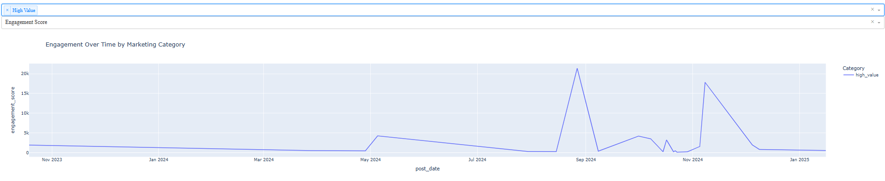
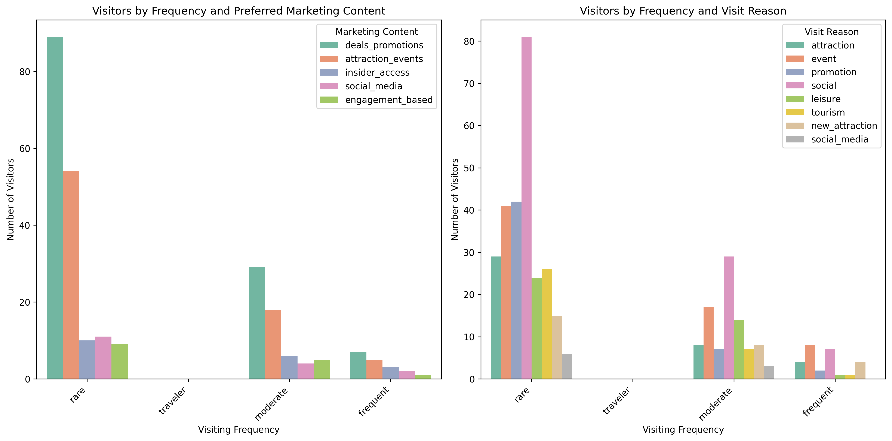

# Overview

The main objective of this project is to evaluate the impact of marketing strategies on guest behaviour through analysing past campaign data to understand changes in visitor segments, identify the most effective marketing content that drives engagement and visitation, and finally, recommend tailored marketing strategies to attract and retain different guest segments.

# Retrieving Data

The data used in this project consists of:
1. Instagram post metrics from @universalstudiossingapore extracted using Instaloader (https://instaloader.github.io/module/structures.html).
2. Survey responses collected from theme park visitors.

## Instagram Data
### Instagram Data Extraction
As detailed in data/Instagram/README.md, we used Instaloader to extract the following post attributes:
`shortcode`: Unique identifier for each post.
`caption`: Text content accompanying the post.
`num_likes`: Number of likes.
`comments`: List of comments.
`post_date`: Date of publication.
`post_type`: Type of media (image, video, carousel).

### Data Cleaning
After extraction, we performed the following preprocessing steps:
1. Convert `post_date` to datetime format
2. Transform `comments` into a dictionary {user1: [comment], user2: [comment], ...}
3. Standardise textual data in caption and comments by removing stopwords and whitespaces, lowercasing and lemmatisation.

### Feature Engineering
After cleaning the dataset, we performed additional transformations to derive meaningful insights:
#### 1. Post classification via Bag of Words
- We manually defined a Bag of Words (BoW) to classify captions into different marketing categories.
- This enabled us to analyse the effectiveness of various marketing strategies based on engagement metrics and identify guest segments based on their interactions with different content types.
- For example, if posts categorised under `family_friendly` receive high engagement, it su%ggests a segment of guests who are highly interested in family friendly experiences.

#### 2. Comment Volume (`num_comments`)
- We computed the number of comments for each post to measure engagement levels.

#### 3. Sentiment Analysis (`sentiment`)
- Using `VaderSentiment`’s `SentimentIntensityAnalyzer`, we computed the average sentiment score for comments on each post.

#### 4. Engagement Score (`engagement_score`)
To quantify overall engagement, we computed **engagement score** for each post using the formula:


##### Weighting Factors:
- $\alpha = 1$: Likes indicate passive interest, so they receive the lowest weight.
- $\beta = 2$: Comments require more effort and signify higher engagement, so they are weighted higher.
- $\gamma = 50$: Sentiment is crucial as it reflects how people emotionally react to content. A highly positive post with fewer likes may still be impactful, so it is given the highest weight.
This score allows us to identify which content resonates most with different guest segments, helping refine marketing strategies.

## Survey Data
### Survey Data Processing
We further processed the survey responses from `data/survey_responses/cleaned_survey_responses.csv` to derive useful insights:

#### 1. Mapping Visiting Frequencies  
Visitors were categorised into four segments based on their visiting frequency:  
- **Rare**: Infrequent visitors  
- **Moderate**: Occasional visitors  
- **Frequent**: Regular visitors  
- **Traveller**: Visitors from outside the local area  

#### 2. Spender Categorisation  
Visitors were classified into different spending levels based on their highest expense category:  
- **Low Spenders**: Those who spend the most on transport  
- **Average Spenders**: Those who spend the most on food & beverage (F&B)  
- **High Spenders**: Those who spend the most on merchandise  

#### 3. Mapping Visit Reasons  
Each visitor's reason for visiting was mapped to a predefined category:  

| Reason | Description |
|--------|------------|
| `attraction` | To experience a specific attraction or ride |
| `event` | To attend a special event or seasonal celebration (e.g., Halloween, Christmas, exhibitions in collaboration with other franchises) |
| `promotion` | Because of a special promotion or discount |
| `social` | To spend time with family/friends |
| `leisure` | For a relaxing getaway or vacation |
| `tourism` | As part of a larger travel plan (e.g., trip to the area) |
| `new_attraction` | To visit a newly opened or recently renovated park/area |
| `social_media` | Because of a social media post or influencer recommendation |

#### 4. Mapping Marketing Content Seen  
Visitors' exposure to different marketing channels was grouped into broader categories:  

| Category | Included Sources |
|----------|----------------|
| `online_ads` | Social media ads, online banner ads |
| `tv_commercials` | TV commercials |
| `youtube_influencer` | YouTube videos or influencer content (including overseas theme parks) |
| `email_newsletter` | Email newsletters or promotional offers |
| `physical_ads` | Billboard or outdoor ads, print advertisements (e.g., magazines, brochures) |
| `theme_park_websites` | Theme park websites or blogs |
| `third_party_promotions` | Promotions or discounts from travel agencies or third-party platforms (e.g., Agoda, Groupon) |

#### 5. Mapping Preferred Marketing Content  
Visitors' preferred marketing content types were categorized as follows:  

| Category | Description |
|----------|------------|
| `deals_promotions` | Discounts, special offers, or bundles |
| `attraction_events` | New attractions or event announcements |
| `insider_access` | Behind-the-scenes content or exclusive previews |
| `social_media` | User-generated content (e.g., visitor testimonials, influencer partnerships) |
| `engagement_based` | Interactive experiences (e.g., virtual tours, social media contests) |

These transformations enabled deeper analysis into guest segments, spending behaviors, and the effectiveness of different marketing strategies.  

# Data Analysis
## Analysis of Post Metrics

### Running the Analysis
To analyse the post metrics from the Instagram data, follow these steps:

1. Ensure you are in the `DSA3101-group5` directory.

2. Run the following command in your terminal:

   ```bash
   python marketing_analysis/uss_post_insights_dashboard.py

3. Once the script is running, the terminal will provide a link to access the dashboard. Open this link in your web browser to view the insights.

### Dashboard Features
The dashboard includes the following key features:

1. **Summary Table**: A table summarising the following metrics for each marketing category
- Number of Posts (`post_count`)
- Number of Likes (`avg_likes`)
- Number of Comments (`avg_comments`)
- Sentiment Score (`avg_sentiment`)
- Engagement Score (`avg_engagement_score`)

2. **Comparative Line Chart**: A line chart with a dropdown menu that allows users to compare different metrics (e.g., Likes, Comments, Sentiment, Engagement Score) across various categories (e.g., Family-Friendly, High Value, Influencer, Festive, Is Minion, Deals Promotion, Attraction Event) over time.

### Data Interpretation


On average, marketing strategies that emphasize exclusive experiences and premium offerings (`high_value`) and seasonal excitement and fear appeal (`halloween`) show higher engagement levels.

Engagement levels tend to be higher from **July to October**, suggesting that this period is particularly effective for marketing campaigns.


  
  

The elevated engagement levels on `high_value` and `family_friendly` posts suggest that marketing strategies have attracted more guests interested in premium and family-oriented experiences.

### Limitations
While these insights provide valuable information, there are some limitations to consider:
- **Limited Data Points**: The analysis is based on a relatively small dataset of just over 400 posts spanning from 2022 to 2025. This limited data may affect the reliability of the conclusions drawn and should be taken into account when generalizing findings.
- **Higher Post Engagement**: It is important to note that higher engagement does not necessarily equate to more effective marketing strategies. Engagement metrics can also be influenced by other factors like timing of posts, audience demographics, where different guest segments engage differently. Additionally, high engagement does not necessarily translate into increased park attendace or revenue.

Thus, while engagement metrics provide valuable insights, they should be interpreted alongside other key performance indicators.

## Analysis of Survey Data

### Running the Analysis
To process the survey data and generate visualisations, run:
```bash
python marketing_analysis/marketing_survey.py
```

### Data Interpretation

#### Visitor Spending Patters


Most visitors are average spenders, follwoed by high spenders, and finally low spenders.

#### Visitor Frequency Distribution


Since most visitors rarely visit, there is an opportunity to explore ways to increase repeat visits. 

#### Marketing Content Preferences


Visitors are most attracted to discounts, bundles, and special offers (deals_promotions), followed by new attraction announcements (attraction_events).

#### Visit Reasons and Marketing Preferences by Visitor Frequency 


Discounts, bundles, and special offers (`deals_promotions`) are the most effective marketing strategy across all visitor segments.
The most common reason for visiting among rare, traveller, and moderate visitors is to spend time with family and friends (`social`).

## Marketing Strategy Recommendations

Based on the analysis on USS' Instaram posts and survey responses on guests' marketing preferences and visit motivations, we recommend the following marketing strategies for specific segments:

### 1. Group Discounts & Promotions  
- **Target Audience**: Rare and moderate visitors, families, and friend groups  
- **Rationale**:  
  - Survey data indicates that **discounts, bundles, and promotions** are the most attractive marketing content across all visitor types.  
  - The most common reason for visiting among **rare, traveler, and moderate visitors** is to **spend time with family and friends** (social motivation).  
  - Instagram engagement data also highlights strong interaction with **family-friendly content**.  
- **Implementation**:  
  - Offer **discounted group bundles** (e.g., "Family Fun Packages" or "Friends' Day Out Deals") to encourage social visits.  
  - Prioritize **flash sales, loyalty programs, and early-bird discounts** to incentivize more visits from rare and moderate visitors.  
  - Promote these deals through **targeted social media ads and email marketing campaigns** to reach potential visitors effectively.

### 2. Seasonal High-Value Experiences 
- **Target Audience**: Visitors interested in exclusive experiences (premium spenders)  
- **Rationale**: Instagram engagement data indicates that **"high-value" content**, particularly for **Halloween events**, receives the most interaction. Additionally, engagement is highest from **July to October**.  
- **Implementation**: Introduce **limited-time premium experiences** (e.g., VIP tours, exclusive nighttime events) during peak engagement periods to drive higher spending.  
