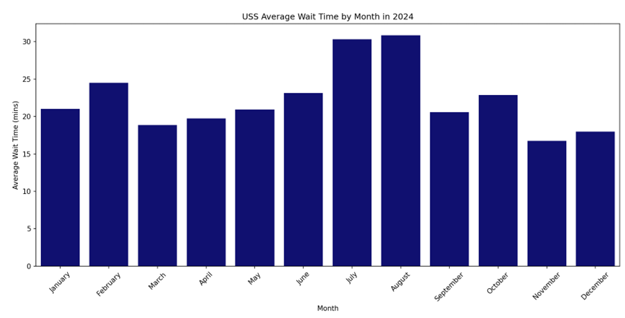

# Guest Demand Insights from Crowd Trends and Survey Data

This analysis integrates **actual wait time data** from Universal Studios Singapore (USS) in 2024 with **guest survey responses** to uncover patterns in guest behaviour and resource needs across time and events.

---

## Plots & Analysis

### 1. Guest Time Slot Preferences

- **Afternoon (12-5pm)** is the most popular visit window, followed by **Morning (10am-12pm)**.
- **Evening (5-7pm)** sees reduced interest, suggesting this period may be suited for reduced operations or shift transitions.

---

### 2. Guest Day Category Preferences

- Guests favour:
    - **Special Events**
    - **School Holidays**
    - **Saturdays**
    - **Weekdays (Mon-Thurs)**
- **Fridays** and **evenings** are less popular, which may indicate opportunities to optimise staffing.

---

### 3. Guest Perception Ratings

#### Key Observations
- **Queue Expectations**: Mixed responses — many guests are neutral or disagree that queueing was better than expected.
- **Ease of Navigation**: Highly rated — most guests find the park easy to navigate.
- **Staff Adequacy & Friendliness**: Positively rated, indicating staff are sufficiently deployed and approachable.
- **Safety Concerns**:
  - Low concern for **violence**, **theft**, and **getting lost**.
  - **Crowd crush** perception is mixed, showing potential concern during peak congestion.
  - Moderate concern for **availability of medical attention**, especially during high-traffic events.

---

### 4. Monthly Wait Time Trends in 2024

- **July** and **August** have the highest average wait times.
- **February** and **October** also show elevated wait times.
- **March**, **April**, **November**, and **December** have the **lowest** average wait times.

### 5. Hourly Wait Time on Normal Days (10am–7pm)

- Guest volume typically peaks between **12pm and 3pm**.
- A gradual drop follows after 3pm — a natural window for **reallocating or rotating staff**.

---

### 6. Hourly Wait Time during Halloween Horror Nights (HHN: 7pm–12am)

- Wait times **peak sharply at 8–9pm** (20:00–21:00).
- A gradual **decline begins after 9pm**, with wait times dropping through 10–11pm (22:00–23:00).

---

## Insights Summary

- Guest demand is **highly time- and event-dependent**, with peaks in the **afternoon**, **school holidays**, and **special events**, informing when to scale up operations.
- **Queue management** remains a key area for operational improvement — better forecasting and staff deployment can reduce wait-time dissatisfaction.
- The park performs well in **staff friendliness** and **navigability**, which supports **maintaining current service standards** while reallocating staff during less critical periods.
- **Perceived risks** such as **crowd crush** and **lack of medical readiness** highlight the need for **targeted staff training and emergency preparedness** during peak events like HHN.

> These insights directly support **cost-effective staffing strategies**, **guest satisfaction**, and **park safety enhancements**, offering tangible directions for resource allocation and operational planning.

---

## Business Recommendations

Based on insights from guest behaviour and wait time trends, the following strategies are proposed to improve operational efficiency and guest satisfaction:

- **Cross-train staff for flexible deployment**
    - Enable staff to take on multiple roles and assign **floating staff** based on model-driven demand forecasts. This ensures surge coverage without increasing overall headcount.

- **Leverage self-service kiosks for F&B**
    - Reduce dependency on fixed F&B manpower by **deploying kiosks** in high-traffic areas, lowering labour costs while maintaining service levels.

- **Engage part-time support during peaks**
    - During **school holidays, weekends, and special events**, bring in **part-timers** to support operations without incurring long-term staffing commitments.

These measures work hand-in-hand with the **staff optimisation model**, ensuring demand-responsive staffing while controlling operational expenditure.

---

## 📁 Files Referenced

| Script                             | Description                                                  |
|------------------------------------|--------------------------------------------------------------|
| `survey_data_resource_allocation.py` | Analyzes guest survey responses on timing & safety            |
| `seasonality_daily_trend.py`        | Analyzes crowd trends by hour and month                       |
